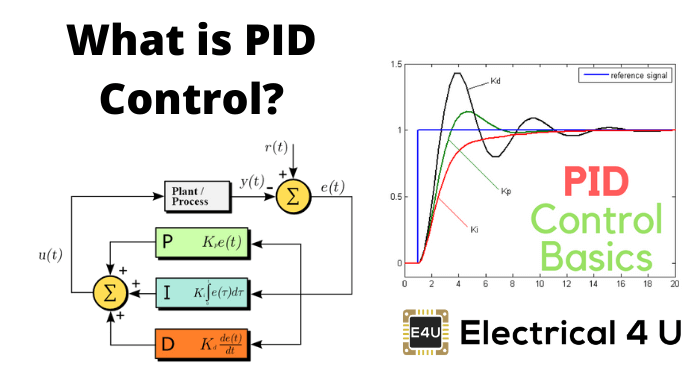
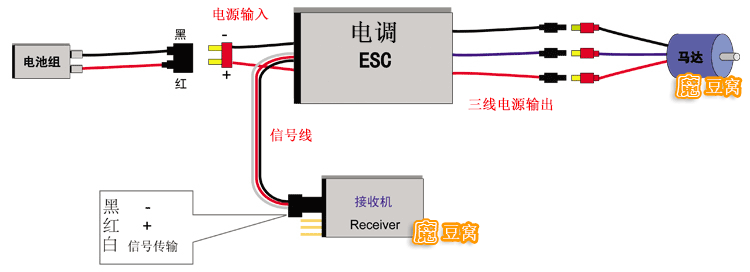
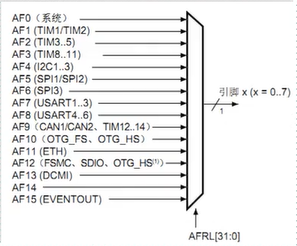
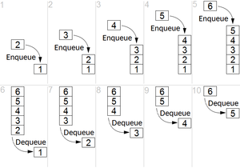
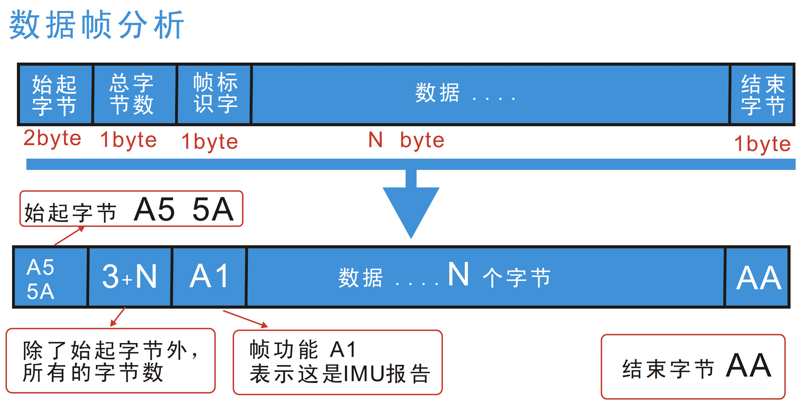

<!-- START doctoc generated TOC please keep comment here to allow auto update -->
<!-- DON'T EDIT THIS SECTION, INSTEAD RE-RUN doctoc TO UPDATE -->
**Table of Contents**  *generated with [DocToc](https://github.com/thlorenz/doctoc)*

<!-- END doctoc generated TOC please keep comment here to allow auto update -->

<!-- 更新目录需要把原始目录移动到文档开头 并运行 doctoc README.md 若未安装doctoc 可使用npm 安装命令： npm install doctoc -g   -->
# RoboMaster 电控系统上手指南
施工中👷预计8月16号左右完工。。。。 hmmm 16号没写完。。。不过快写好了。。。
- [RoboMaster 电控系统上手指南](#robomaster-电控系统上手指南)
- [Introduction](#introduction)
- [概念部分](#概念部分)
  - [基础概念](#基础概念)
    - [ROBOMASTER开发版](#robomaster开发版)
    - [STM32](#stm32)
    - [微控制器（MCU）和CPU区别](#微控制器mcu和cpu区别)
    - [PID](#pid)
    - [PWM](#pwm)
    - [BLDC电机以及电调](#bldc电机以及电调)
  - [进阶概念](#进阶概念)
    - [GPIO](#gpio)
    - [IO复用](#io复用)
    - [FIFO](#fifo)
    - [寄存器（register）](#寄存器register)
    - [DMA](#dma)
    - [多任务处理](#多任务处理)
  - [通讯协议](#通讯协议)
    - [串口/UART](#串口uart)
    - [CAN](#can)
    - [I2C](#i2c)
    - [自定义协议](#自定义协议)
  - [代码规范](#代码规范)
  - [未来任务](#未来任务)

# Introduction

这份指南适合对嵌入式开发没有经验但是有一定电子电路基础的同学。这份指南会解释一些常见概念以及会包含嵌入式开发的小技巧。

# 概念部分

## 基础概念

这部分主要介绍一些背景知识以及我们日常工作中会遇到的一些概念

### ROBOMASTER开发版

RoboMaster开发板套件是一款面向机器人DIY的开源主控套件。开发板主控芯片为**STM32F427IIH6**，拥有丰富的扩展接口和通信接口，板载IMU传感器，可配合RoboMaster出品的M3508、 M2006直流无刷减速电机、UWB模块以及妙算等产品使用。

### STM32

STM32 是意法半导体推出的基于ARM内核的嵌入式**微控制器（MCU）**。在Robomaster中使用的STM32F427 MCU是基于CortexM4 CPU的高性能微控制器。

### 微控制器（MCU）和CPU区别

通常MCU会简化一些CPU内计算资源，但是MCU会集成更多的IO资源。通常，MCU上面不会运行操作系统。我们在编写MCU上运行的软件时需要自行进行多任务处理以及直接对**寄存器**进行操作。对MCU进行开发时我们需要参考官方手册了解芯片内资源。

### PID

PID是最常见的控制算法，他是比例（propotion）积分（intergration）微分（derivation）控制的缩写。PID 是最常见的控制算法。其中比例控制附负责稳态控制，微分控制负责瞬态响应，积分控制负责过去误差。 for example，如果我们想使用PID控制电机转动的角度，比例控制将会控制目标角度与实际电机角度的差值，微分控制将会控制电机转速，积分控制将会补偿电机过去转动的角度。PID的一些分支有级联PID 自适应PID 等。[PID - WikiPEDIA](https://zh.wikipedia.org/wiki/PID%E6%8E%A7%E5%88%B6%E5%99%A8
) 

### PWM

PWM是Pulse Width Modul ation的缩写是一种调制方式。PWM信号为数字信号，在同一个时间只有打开（1）和关闭（0）两种信号。 通过调整1和0的时间比例，这样我们就可以使用数字信号表示模拟数值。PWM信号使用占空比（1 和 0 信号的比例）来表示信号的大小。目前我们的子弹发射电机是由PWM进行控制的.

### BLDC电机以及电调

 直流无刷电机（BLDC Motor）作为电机的一种具有体积小，效率高的优点。与传统直流电机不同的是 BLDC电机里面没有电刷，它依靠电调将直流信号调制成三个相位不同的方波。 BLDC和普通三相电机一样，电源的频率越高电机的转速越高。

对于它们的连接，一般情况下是这样的：
1. 电调的输入线与电池连接；
2. 电调的输出线（有刷两根、无刷三根）与电机连接；
3. 电调的信号线与接收机连接。

我们的机器人一般会使用**CAN总线** 或者 **PWM** 将我们想要的转速发送给电调。

[延伸阅读](http://www.modouwo.com/AiHaoZhe/Tutorial/Detail/UAV/744/13)

## 进阶概念

这部分主要讲了关于嵌入式开发的一些概念。开发新功能时可同时参考芯片官方手册以及开发版原理图。A 版使用的STM32F427IIH6手册在[这里](https://www.st.com/resource/en/reference_manual/rm0090-stm32f405415-stm32f407417-stm32f427437-and-stm32f429439-advanced-armbased-32bit-mcus-stmicroelectronics.pdf)  [datasheet](https://www.st.com/resource/zh/datasheet/stm32f427ii.pdf)

### GPIO

GEneral-Purpose input/output （GPIO） 是通用型输入输出的简称。引脚可以自由的提供给使用者自由使用。我们可以通过写入**寄存器**来控制引脚电平。 对于一些特殊功能我们可以通过写入专用寄存器来控制。

### IO复用 

由于芯片内部资源远多于引脚数目，我们需要通过选择器将内部资源映射到引脚上面。这个过程就是IO复用。
端口服用映射示意图：

STM32F4 中 GPIO由端口A排列到端口K，每个端口内部也对应有若干对应的引脚。例如 PIN：E7对应了E端口pin7.引脚映射我们可以通过查询原理图以及芯片datasheet取得。设置复用时我们首先需要设置复用寄存器并且设置引脚的init structure 然后使用GPIO_Init函数来初始化引脚。 示例代码：

> GPIO_PinAFConfig(GPIOE,GPIO_PinSource7,GPIO_AF_UART7); //GPIOE7复用为USART7
> GPIO_PinAFConfig(GPIOE,GPIO_PinSource8,GPIO_AF_UART7); //GPIOE8复用为USART7
> //USART3端口配置
> GPIO_InitStructure.GPIO_Pin = GPIO_Pin_7 | GPIO_Pin_8; //GPIOE7与GPIOE8
> GPIO_InitStructure.GPIO_Mode = GPIO_Mode_AF;//复用功能
> GPIO_InitStructure.GPIO_Speed = GPIO_Speed_50MHz;	//速度50MHz
> GPIO_InitStructure.GPIO_OType = GPIO_OType_PP; //推挽复用输出
> GPIO_InitStructure.GPIO_PuPd = GPIO_PuPd_UP; //上拉
> GPIO_Init(GPIOE,&GPIO_InitStructure); //初始化PE7，PE8

### FIFO

FIFO是First In First Out 先入先出的缩写。首先到达FIFO的数据将会首先读取出来。在MCU内一般用作数据缓冲区。比如在**串口**进行接收的时候，我们可以先将接收到的数据存到FIFO内，当MCU进行读取操作时再读取FIFO内数据。

 

### 寄存器（register）

寄存器是MCU内的高速记忆体，在计算机里一般用来存储临时数据。在使用IO资源时我们可以将需要的数据写入对应的专用寄存器。例如在UART通讯时，我们首先需要将需要发送的数据写入UART专用寄存器，UART模块将数据自动转坏为对应电平。

### DMA

由于内存速度一般远远慢于CPU计算时间，为了节约在memory上面所花费的时间，Direct Memory Access （DMA）被开发出来了。DMA可允许不同模块直接访问内存地址。比如没有设置DMA时CAN总线数据将经过CPU，然后被写入CAN寄存器。配置DMA之后CAN数据可以直接写入CAN寄存器。

### 多任务处理

由于CPU运算速度极快，在单一核心处理多任务时一般会采用time sharing的模式。即不同时间处理不同的任务。对于多任务处理一般会有三种方式。

- **轮询（pooling）:** 轮询是最简单的多任务处理方式。程序会以规定频率以次执行不同任务。一般可以通过在计算处理时间并使用if判断是否执行轮询。
- **中断（interrrupt）:** 在处理异步任务时比如IO等随机事件，由于我们不能准确的知道事件发生的时间我们需要另外一种触发方式。当某些事件会触发相应代码时我们叫它**中断**。 在STM32 MCU中，中断是由 NVIC_IRQ 进行处理的。在使用时我们需要初始化一个 **NVIC_InitStructure** 来配置相关中断并调用 **NVIC_Init()** 函数来初始化中断。 
- **OS/RTOS:** 另外一种多任务处理方法，也是我们日常会使用到的技术是操作系统。操作系统作为一个抽象层管理了各种中断。 在操作系统中，多任务的最小粒度是线程（Thread）。在同一个核心上，操作系统会自动为每个核心分配执行时间。RTOS 作为操作系统的一种，他可以保证程序执行时的时序。

## 通讯协议

这部分文档介绍了我们机器人上比较常见的通讯方法。并且介绍了如何自己设计一个简单的通讯协议。

### 串口/UART

串口通讯是最简单的通讯方法之一。他一般需要三个端口 Tx，Rx，以及GND。串口需要事先协商好通讯速率。数据会从Tx端口发送到对方的Rx端口。在通讯时我们需要事先约定一个速度 **（baudrate）** 数据将会从Tx口发送至Rx口。在进行开发时我们需要注意端口电平的匹配。UART通常为3.3V电平，但是有些设备使用5V/1.5V/甚至12V电平。开发时需要注意不要烧毁设备。

### CAN

CAN是控制器局域网络的简称，是ISO国际标准化的串行通信协议。它的英文全称是Controller Area Network，一般简写为CAN。CAN是由以研发和生产汽车电子产品著称的德国BOSCH公司开发的，并最终成为国际标准（ISO 11898），是国际上应用最广泛的现场总线之一。CAN总线通常速度比串口要快。

### I2C

### 自定义协议

在嵌入式开发中，我们经常会遇到不同模块之间的通讯问题。最简单的方法是就是直接发送需要的数据到下位机上。但是这会产生许多问题。首先下板间通讯并不稳定，数据在传输的过程中经常会出现错误。我们可以引入一个校验位来解决。最简单的校验方法是奇偶校验（Parity Check）我们可以对数据进行二进制加法。并且取结果的最后一位进行发送。在接收时，接收端进行同样的操作并比对接收到的parity bit。然而这样做只可以检测到奇数比特错误，在有偶数位数据出错时，程序会通过parity check。为了解决这个问题，我们可以通过扩大parity bit的数量。
 
## 代码规范

## 未来任务

